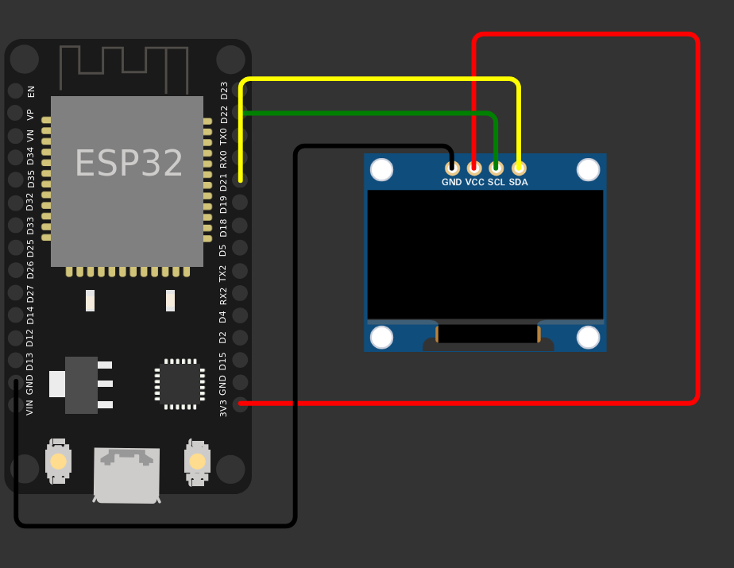

# ESP32 LyricsPlayer

A wireless lyrics display built around an ESP32 and OLED screen.

The system allows a smartphone to play a song while displaying its time-synchronized lyrics line-by-line on an OLED. The smartphone handles music playback and lyric synchronization, while the ESP32 receives lyric data over WebSockets and manages the display, timing, and animations.



**Repository:** https://github.com/Swastik369/ESP32-LyricsPlayer

---

## Overview

The project combines embedded systems, wireless communication, real-time synchronization, text processing, and OLED graphics.

The smartphone acts as the master clock. It obtains time-synchronized lyrics and sends the relevant lyric information to the ESP32. The ESP32 maintains local timing between synchronization updates so that display animations remain smooth without requiring continuous network updates.

The system does not transmit or store the audio on the ESP32. The music remains on the smartphone, while the ESP32 receives only the information required to render the lyrics.

---

## System Architecture

```text
                  Smartphone
                      |
             Music + Lyrics Data
                      |
                  WebSocket
                      |
                      v
                  ESP32
                      |
        +-------------+-------------+
        |             |             |
        v             v             v
   Lyric State    Local Timer   Transliteration
        |             |             |
        +-------------+-------------+
                      |
                      v
               Display Engine
                      |
                      v
                    OLED
```

---

## How It Works

1. The smartphone plays the selected song.
2. Time-synchronized lyrics are obtained on the smartphone.
3. The current lyric and its timing information are sent to the ESP32 through a WebSocket connection.
4. The ESP32 updates its internal lyric state.
5. A local timer interpolates the timing between synchronization updates.
6. The display engine renders the current lyric, progress indicator, transitions, and equalizer animation.
7. The OLED continuously updates according to the current playback position.

This architecture separates communication, timing, and rendering, allowing the ESP32 to maintain smooth visual output even when network updates are not perfectly periodic.

---

## Synchronization

Synchronization is handled using the smartphone as the authoritative clock.

Rather than depending on a new network message for every animation frame, the ESP32 uses received timing information to run its own local timer.

```text
Smartphone
    |
    | Timestamp + lyric
    v
ESP32
    |
    | Local timing
    v
Display Engine
    |
    +---- Lyric animation
    |
    +---- Progress bar
    |
    +---- Equalizer
    |
    v
OLED
```

This reduces the dependency of the display animation on network latency and provides smoother rendering.

---

## WebSocket Communication

The ESP32 hosts a lightweight web interface and communicates with the smartphone using WebSockets.

WebSockets were selected because they provide a persistent, low-overhead communication channel suitable for real-time lyric updates.

The communication layer is responsible for transferring information such as:

* Current lyric text
* Timing information
* Playback state
* Synchronization events

The ESP32 does not need to continuously poll the smartphone for updates.

---

## OLED Display

The OLED interface consists of several visual components.

### Lyric Display

The current lyric line is displayed as the primary content.

### Line Transitions

New lyric lines are animated onto the display instead of simply replacing the previous line.

### Progress Indicator

A progress bar represents the playback progress of the current lyric.

```text
████████████░░░░░░░░
```

### Equalizer

An animated equalizer provides additional visual feedback during playback.

```text
▂ ▅ ▃ ▇ ▂ ▆ ▄ ▅
```

These elements are rendered locally by the ESP32.

---

## Hindi Lyrics Support

The OLED font used by the project is primarily intended for Latin characters. Direct rendering of Devanagari characters would therefore require additional font resources and significantly more display memory.

The project addresses this using a Devanagari-to-Roman transliteration system.

For example:

```text
तुम
↓
tum
```

The transliteration system also incorporates schwa deletion to produce more natural Romanized Hindi rather than performing a simple character-by-character conversion.

This allows Hindi lyrics to be displayed on the existing OLED without requiring a full Devanagari font.

---

## Hardware

| Component    | Purpose                                  |
| ------------ | ---------------------------------------- |
| ESP32        | Main controller and Wi-Fi communication  |
| OLED display | Lyrics and graphical interface           |
| Smartphone   | Music playback and lyric synchronization |
| USB power    | System power                             |

The system does not require an SD card because the audio remains on the smartphone.

---

## Software Architecture

```text
+--------------------------------------+
|              Smartphone              |
|                                      |
| Music Playback                       |
|       |                              |
|       v                              |
| Synchronized Lyrics                  |
|       |                              |
|       v                              |
| WebSocket Communication              |
+------------------+-------------------+
                   |
                   v
+--------------------------------------+
|                ESP32                 |
|                                      |
| WebSocket Receiver                   |
|       |                              |
|       v                              |
| Lyric State Manager                  |
|       |                              |
|   +---+-----------+                  |
|   |               |                  |
|   v               v                  |
| Local Timer   Transliteration        |
|   |               |                  |
|   +-------+-------+                  |
|           |                          |
|           v                          |
|      Display Engine                  |
|           |                          |
|     +-----+------+                   |
|     |     |      |                   |
|   Lyrics Progress Equalizer           |
|           |                          |
+-----------+--------------------------+
            |
            v
          OLED
```

---

## Engineering Challenges

### Library Compatibility

Different library versions introduced compatibility issues during development. Resolving these required investigating library APIs and adapting the implementation to the installed versions.

### Arduino Automatic Prototypes

Arduino's automatic function-prototype generation caused a compilation issue involving a `struct`.

The generated prototype was placed in an inappropriate location, resulting in compiler errors that were not immediately obvious from the original source code.

This required understanding the additional preprocessing performed by the Arduino build system.

### Network Timing

Network communication does not provide perfectly consistent latency.

Using the network connection as the direct source of every display frame would therefore introduce unnecessary visual jitter.

The implementation instead separates the system into three stages:

```text
Network Synchronization
          |
          v
    Local ESP32 Timing
          |
          v
    Display Rendering
```

This allows the ESP32 to continue rendering animations between synchronization events.

---

## Repository

The complete source code is available on GitHub:

https://github.com/Swastik369/ESP32-LyricsPlayer

Clone the repository with:

```bash
git clone https://github.com/Swastik369/ESP32-LyricsPlayer.git
cd ESP32-LyricsPlayer
```

---

## Getting Started

### Requirements

* ESP32 development board
* OLED display
* USB cable
* Smartphone
* Arduino IDE or compatible ESP32 development environment

### Installation

1. Clone the repository.
2. Open the ESP32 firmware in the development environment.
3. Install the required libraries.
4. Connect the OLED display to the ESP32.
5. Configure the required network settings.
6. Upload the firmware.
7. Open the ESP32 web interface from the smartphone.
8. Establish the WebSocket connection and begin playback.

Refer to the source code for the current pin configuration and library requirements.

---

## Project Structure

The repository contains the ESP32 firmware, web interface, and supporting project files.

```text
ESP32-LyricsPlayer/
|
+-- Firmware / ESP32 source
|
+-- Web interface
|
+-- Supporting files
|
+-- ckt.png
|
+-- README.md
```

The exact structure may change as the project develops.

---

## Project Motivation

The project was developed as an exploration of combining several embedded-system concepts into a single practical application.

The main engineering areas involved are:

* ESP32 embedded programming
* Wi-Fi communication
* WebSocket-based data transfer
* Real-time synchronization
* Local timing and animation
* OLED graphics
* Text processing
* Hindi transliteration
* Debugging embedded software and library compatibility

The resulting system demonstrates how a relatively small microcontroller can function as a dedicated wireless display while delegating computationally heavier tasks such as music playback and lyric retrieval to a smartphone.

---

## Author
GitHub: https://github.com/Swastik369/ESP32-LyricsPlayer
